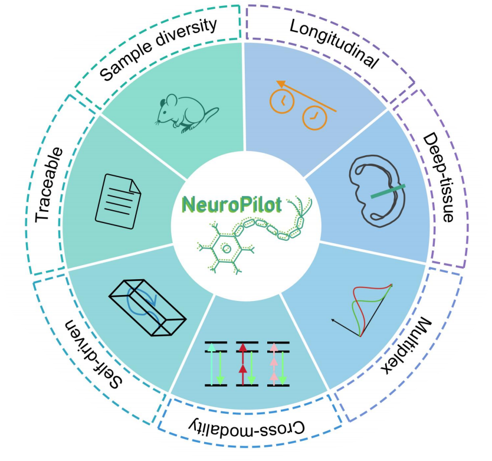
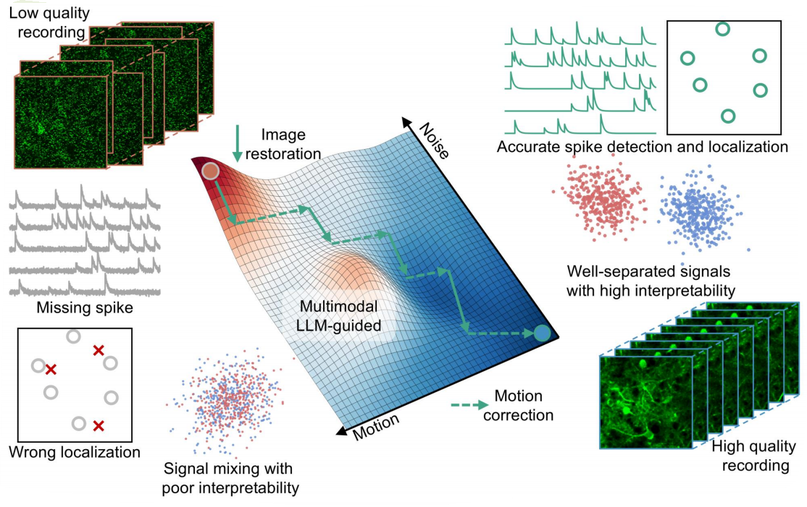
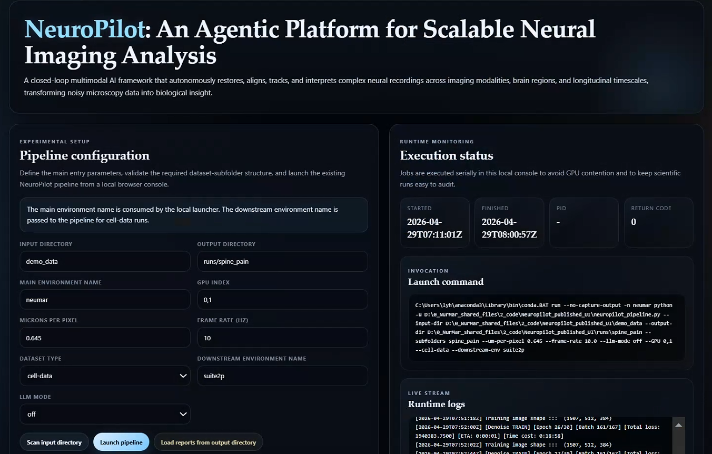

# NeuroPilot

NeuroPilot is a local calcium-imaging pipeline for iterative denoising, motion correction, optional downstream segmentation, and deterministic HTML reporting.



## What It Does

- runs iterative denoising and registration from a single main entry
- optionally runs cell-data downstream analysis in a separate `suite2p` environment
- writes a per-stack `report.html` for browser-based review
- supports a local browser UI for parameter entry, job launch, monitoring, and report viewing



## Environments

Create the main environment:

```bash
conda env create -f environment-neumar.yml
conda activate neumar
```

If you want `cell-data` downstream analysis, also create the downstream environment:

```bash
conda env create -f environment-suite2p.yml
```

Default environment names:

- main pipeline: `neumar`
- downstream segmentation: `suite2p`

## Input Layout

`--input-dir` must contain first-level dataset subfolders. Each subfolder may contain one or more `.tif` or `.tiff` files.

```text
/path/to/datasets/
  sample_a/
    sample_a_01.tif
    sample_a_02.tif
  sample_b/
    sample_b_01.tif
```

If your TIFF files are flat at the input root, prepare them first:

```bash
python prepare_input_tiffs.py --input-dir /path/to/flat_tif_folder
```

That helper keeps the TIFF content usable by the pipeline by organizing files into subfolders.

## Main Entry

Minimal run:

```bash
python neuropilot_pipeline.py --input-dir /path/to/datasets --output-dir /path/to/run_output
```

Common options:

- `--input-dir`: dataset root containing subfolders
- `--output-dir`: run output root
- `--subfolders`: optional subset such as `sample_a,sample_b`
- `--GPU`: GPU index or comma-separated indices, default `0`
- `--um-per-pixel`: microns per pixel used by reports and pre-segmentation profiling, default `0.645`
- `--frame-rate`: frame rate in Hz used by reports and downstream settings, default `10`
- `--llm-mode`: `off`, `shadow`, or `apply`
- `--cell-data`: enable cell-data downstream analysis
- `--non-cell-data`: skip cell-data downstream analysis
- `--downstream-env`: downstream conda environment name, default `suite2p`

Cell-data example:

```bash
python neuropilot_pipeline.py \
  --input-dir /path/to/datasets \
  --output-dir /path/to/run_output \
  --cell-data \
  --downstream-env suite2p \
  --llm-mode off \
  --GPU 0 \
  --um-per-pixel 0.645 \
  --frame-rate 10
```

Non-cell-data example:

```bash
python neuropilot_pipeline.py \
  --input-dir /path/to/datasets \
  --output-dir /path/to/run_output \
  --non-cell-data \
  --llm-mode off \
  --GPU 0 \
  --um-per-pixel 0.645 \
  --frame-rate 10
```

If `--subfolders` is omitted, all valid first-level subfolders are processed.

## Local UI

Launch the local browser UI:

```bash
python neuropilot_local_ui.py --open-browser
```



The UI binds to `127.0.0.1` and provides:

- input and output directory selection
- main environment and downstream environment selection
- GPU, `um-per-pixel`, and `frame-rate` entry
- subfolder scanning and validation
- in-place preparation of flat TIFF inputs when needed
- live job logs
- direct embedded viewing of generated `report.html`

Recommended UI workflow:

1. Enter `input-dir` and `output-dir`.
2. Set `main environment name`, `GPU`, `um-per-pixel`, and `frame-rate`.
3. Choose `cell-data` or `non-cell-data`.
4. If using `cell-data`, confirm the downstream environment name.
5. Click `Scan input directory`.
6. If flat TIFF files are detected, use the prepare button.
7. Select the valid subfolders to process.
8. Launch the pipeline and review `report.html` in the built-in viewer.

## Outputs

NeuroPilot writes outputs under:

```text
<output-dir>/<dataset-subfolder>/
```

Typical per-stack artifacts include:

- `final/final_stack.tif`
- `manifests/pipeline_manifest.json`
- `report/report.html`
- `segmentation/` for cell-data downstream outputs

The UI discovers `report.html` recursively under the chosen output directory.

## Demo

The repository includes a small demo dataset:

```text
demo_data/quick_demo/demo_data.tif
```

Run it from the repository root:

```bash
python neuropilot_pipeline.py \
  --input-dir demo_data \
  --subfolders quick_demo \
  --output-dir runs/quick_demo \
  --non-cell-data \
  --llm-mode off \
  --GPU 0 \
  --um-per-pixel 0.645 \
  --frame-rate 10
```

Or start the UI and use:

- input directory: `demo_data`
- output directory: `runs/local_ui_demo`
- subfolder: `quick_demo`

## Notes

- `llm-mode apply` requires `OPENAI_API_KEY`
- `cell-data` uses the downstream environment only for the downstream stage
- the final report is generated after the stack and downstream artifacts are materialized
